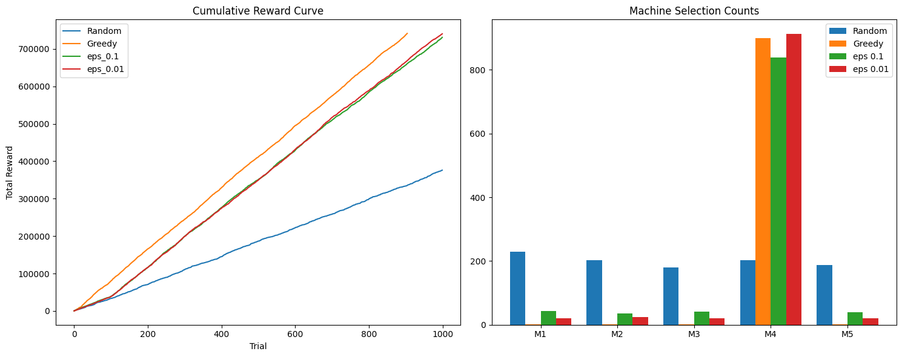
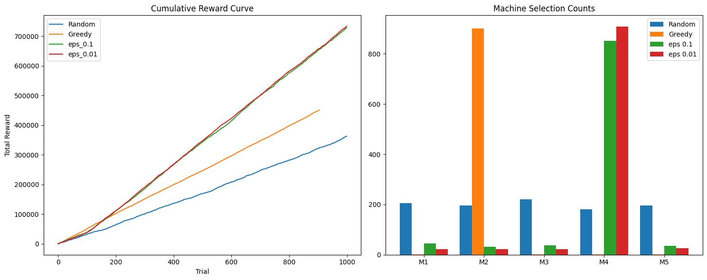

# Multi-Armed Bandit (MAB) 실습

여러 개의 슬롯머신 중에서 가장 보상이 높은 머신을 찾는 **Multi-Armed Bandit** 문제를 실습하는 프로젝트입니다.

## 문제 정의

카지노에 슬롯머신 5개가 있다. 각 머신은 서로 다른 **평균 보상**을 가지지만, 그 값을 미리 알 수 없다. 직접 당겨 보며 학습해야 한다.

- **환경**: 슬롯머신 5대, 각 머신마다 다른 평균 보상 (예: 200, 500, 100, 800, 300)
- **보상**: 정규분포로 확률적으로 지급 (평균 μ, 표준편차 σ)
- **목표**: 제한된 시도(예: 1,000번) 안에 누적 보상을 최대화

## 실습 구조

### 1. 환경 설계

- 머신 5개, 각각 다른 평균 보상과 표준편차
- 보상은 정규분포에서 샘플링

### 2. 전략 구현

| 전략                  | 설명                                                                     |
| --------------------- | ------------------------------------------------------------------------ |
| **Random**            | 매 시도마다 무작위로 머신 선택                                           |
| **Greedy**            | 초기에 각 머신을 한 번씩 당긴 뒤, 추정 평균이 가장 높은 머신만 계속 선택 |
| **ε-greedy (ε=0.1)**  | 10% 확률로 무작위 선택, 90% 확률로 추정 최고 머신 선택                   |
| **ε-greedy (ε=0.01)** | 1% 확률로 무작위 선택, 99% 확률로 추정 최고 머신 선택                    |

### 3. 실험 조건

- 총 **1,000번** 선택
- **누적 보상** 기록
- **머신별 선택 횟수** 기록

### 4. 결과 분석

- **누적 보상 곡선**: 시도 횟수에 따른 총 보상 비교
- **머신별 선택 횟수**: 각 전략이 어떤 머신을 얼마나 선택했는지

---

## 실험 결과

동일한 코드로 실행해도 **초기 샘플에 따라** Greedy의 성능이 크게 달라질 수 있다.

### Result 1: Greedy가 높게 나온 경우

이 실험에서는 Greedy 전략이 초기에 “최선에 가까운” 머신을 잘 골라, 누적 보상이 가장 높게 나왔다. ε-greedy도 비슷하게 좋은 머신(M4)에 수렴하여 높은 보상을 기록했다.

- **왼쪽**: 누적 보상 곡선 — Greedy(주황)가 가장 위에 있음.
- **오른쪽**: 머신별 선택 횟수 — Greedy, eps_0.1, eps_0.01 모두 M4를 많이 선택했고, 이로 인해 높은 보상을 얻음.

→ **초기 추정이 운 좋게 맞았을 때**는 Greedy도 매우 좋은 성능을 보인다.

---

### Result 2: Greedy가 낮게 나온 경우

이 실험에서는 Greedy가 **잘못된 머신(예: M2)**에 일찍 고정되어, 누적 보상이 Random보다 낮거나 비슷하게 나올 수 있다. ε-greedy는 탐색 덕분에 더 좋은 머신(M4)을 찾아 더 높은 보상을 얻었다.

- **왼쪽**: 누적 보상 곡선 — Greedy(주황)가 Random보다 낮거나 비슷하고, eps_0.1, eps_0.01이 더 높음.
- **오른쪽**: 머신별 선택 — Greedy는 M2에 집중했고, ε-greedy는 M4를 많이 선택함.

→ **초기 추정이 틀리면** Greedy는 잘못된 머신만 계속 당기므로 성능이 나쁘다.

---

## 왜 결과가 달라질까?

- **Greedy**: 처음 몇 번의 결과만 보고 “최고”라고 판단한 머신만 계속 선택한다.
  - 운이 좋으면 → **Result 1**처럼 높은 성능
  - 운이 나쁘면(노이즈 때문에 잘못된 머신이 1등으로 보이면) → **Result 2**처럼 낮은 성능

- **ε-greedy**: 일정 비율(ε)로 다른 머신을 탐색하므로, 잘못 고정되더라도 나중에 더 좋은 머신을 찾을 수 있어 **Result 2**에서도 상대적으로 높은 보상을 얻는다.

---

## 실습에서 다루는 질문

1. **Greedy 전략은 왜 실패할 수 있나?**  
   초기 표본이 적을 때 노이즈 때문에 “진짜 최고”가 아닌 머신이 1등으로 추정될 수 있고, Greedy는 그 머신만 계속 선택해 개선 기회가 없어진다.

2. **ε이 너무 크면?**  
   탐색이 과해져 Random에 가까워지고, 좋은 머신을 골라도 자주 다른 머신을 당기므로 누적 보상이 떨어진다.

3. **ε이 너무 작으면?**  
   탐색이 거의 없어져 Greedy와 비슷해지고, 초기 추정이 틀리면 Greedy와 같은 실패를 반복할 수 있다.

4. **Exploration이 필요한 이유?**  
   제한된 시도로는 “한 번 당겨본 값”만으로는 진짜 평균을 알 수 없다. 적당한 탐색(exploration)을 해야 더 좋은 머신을 찾고, 그 다음에 활용(exploitation)을 늘려 보상을 최대화할 수 있다.

---

## 실행 방법

1. `Multi_Armed_Bandit_실습코드.ipynb`를 Jupyter 또는 Colab에서 연다.
2. 순서대로 셀을 실행한다.
3. 마지막 시각화 셀에서 누적 보상 곡선과 머신별 선택 횟수를 확인한다.

필요 라이브러리: `numpy`, `matplotlib`, `random` (표준 라이브러리).

---

## 파일 구성

- `Multi_Armed_Bandit_실습코드.ipynb` — 실습 코드 및 설명
- `result1.png` — Greedy가 높게 나온 실험 결과
- `result2.png` — Greedy가 낮게 나온 실험 결과
- `README.md` — 이 문서
